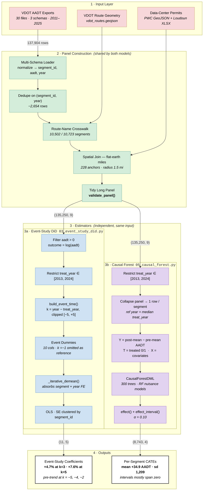

# Architecture — Event-Study DiD & Causal Forest

Pipeline for the two estimators used in this study. Shapes are annotated on the
edges in `(rows, cols)` form, following the tensor-shape convention.

---

## Full Pipeline

---

## Shape Reference

| Stage | Object | Shape | Note |
|---|---|---|---|
| 1 | Raw AADT rows | `(137,904, 5)` | 30 files, 3 schemas |
| 2 | After dedupe | `(135,250, 5)` | 2,654 exact duplicates removed |
| 2 | **Tidy panel** | `(135,250, 9)` | `PANEL_COLUMNS` contract |
| 3a | DiD design matrix | `(n, 10)` | 10 event dummies, `k=−1` omitted |
| 3a | Coefficient table | `(11, 5)` | `event_time, coef, se, ci_low, ci_high` |
| 3b | Collapsed units | `(8,743, 8)` | 1,465 treated · 8 covariate cols |
| 3b | CATE table | `(8,743, 4)` | `segment_id, effect, ci_low, ci_high` |

---

## Why Two Estimators

Both consume the identical panel but make **different assumptions**, so agreement
would be evidence and disagreement localizes which assumption fails.

| | Event-Study DiD | Causal Forest |
|---|---|---|
| **Question** | Average effect over time, relative to opening | Does the effect vary by road? |
| **Unit of analysis** | Segment × year (full panel) | One row per segment |
| **Key assumption** | Parallel trends | Unconfoundedness given `X` |
| **Built-in check** | Pre-period coefficients (`k < 0`) | Confidence intervals per unit |
| **Time structure** | Preserved (event time) | Collapsed to pre/post delta |
| **Outcome scale** | log AADT → percent | Δ AADT → level |

---

## Known Structural Caveats

Design characteristics visible in the flowchart itself, not defects discovered later:

1. **Shared reference year (3b, C2).** Control segments have no `treat_year`, so
   the causal forest needs one common pre/post split point. Treated segments whose
   actual `treat_year` is far from the median get a mismatched window.
2. **Staggered adoption (3a).** Treatment years span 2013–2024 under two-way FE,
   so already-treated units act as controls — the Goodman-Bacon / Callaway–Sant'Anna
   concern. A heterogeneity-robust estimator is the natural next step.
3. **Endpoint binning (3a, D3).** `clip` collapses every lead ≤ −5 into the `k=−5`
   coefficient, so that bin is stacked rather than a clean single-year estimate.
4. **Covariate sparsity (3b, C3).** `zoning` and `pop_density` are unavailable
   panel-wide, and `road_class` is 94% "Secondary" — the forest has little to split on.
5. **Route-level treatment (2, B4).** Distance is measured anchor → route polyline,
   and all segments on a route inherit the flag. Median VDOT route in the study area
   is **0.17 mi** (95th pct 1.42 mi), so this closely approximates segment-level
   assignment in practice.
